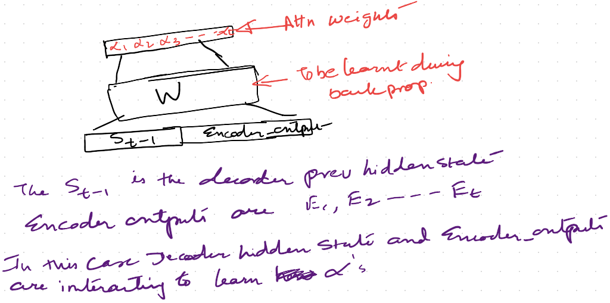

# Problem Statement
This assignment is about working with __Seq2Seq__ class of problems using __Attention__

We are supposed to use 2 public datasets to train on the given example code.
One of the challenges is that the datasets are not meant only for seq2seq problems and have some extra fields which needs to be removed. 
Basically we need to create a dataset with tab seperated lines

first1 second1

first2  second2

...

..

Once we get this kind of structure we can apply the code and train the architecture. 

## Dataset1: Question-Answer Pair

Given a question find the associated answer.
The problem can be easily formulated as a seq2seq problem where encoder is working with the question part and the decoder is generating the answer

We have used the dataset available at  https://www.kaggle.com/c/quora-question-pairs/data this is same as that on http://www.cs.cmu.edu/~ark/QA-data/ (some issues in accessing this site so took the kaggle data)

The data is a tab seperated file with the fields like

ArticleTitle | Question | Answer | DifficultyFromQuestioner | DifficultyFromAnswerer | ArticleFile

### Data Samples:

Abraham_Lincoln Who suggested Lincoln grow a beard? Grace Bedell. hard medium data/set3/a4

Abraham_Lincoln When did the Gettysburg address argue that 
America was born? 1776 hard hard data/set3/a4

Abraham_Lincoln When did the Gettysburg address argue that America was born? 1776. hard hard data/set3/a4

We are only interested in the fields corresponding to the "Question" and "Answer" and hence that has been extracted and saved in a separate file

[QAPairs](https://github.com/TSAI-END3-Group/Session_6_Attention/blob/master/Attention_pytorch_QA_Pairs.ipynb)  contains the code 

## Dataset2: Quora question similarity

* Dataset consists of over 400,000 lines of potential question duplicate pairs.

* Each line contains IDs for each question in the pair, the full text for each question, and a binary value that indicates whether the line truly contains a duplicate pair.

### Data Fields:

* id - the id of a training set question pair
* qid1, qid2 - unique ids of each question 
* question1, question2 - the full text of each question
* is_duplicate - the target variable, set to 1 if question1 and question2 have essentially the same meaning, and 0 otherwise.

### Data sample

The Problem  can be formulated as as Seq2Seq problem in the following way  
Given a question find out another way of writing the same question. These sort of problems are A=>B  (__text entailement__)

We have created a separate file containing only the duplicate pairs. This can be identified by the flag is_duplicate
The network will be trained to understand how the same sentence can be written in another way

question1, question2

[Quora](https://github.com/TSAI-END3-Group/Session_6_Attention/blob/master/Attention_pytorch_QA_Pairs.ipynb)  contains the code 

## Code Files

* [QAPairs](https://github.com/TSAI-END3-Group/Session_6_Attention/blob/master/Attention_pytorch_QA_Pairs.ipynb)  contains the QA pair code 

* [Quora](https://github.com/TSAI-END3-Group/Session_6_Attention/blob/master/Attention_pytorch_QA_Pairs.ipynb)  contains the Quora duplicate questions code 

## Results

### Question Answers Pair

#### Training result

Model is converging. The result is after 75000 epoch

#### Evaluation

Testing random samples with the trained model

#### Attention visualization 
We can see an example of how the attention is being used

### Quora Duplicate Questions

#### Training result
Model is converging. The result is after 75000 epoch

#### Evaluation
Testing random samples with the trained model

#### Attention visualization 
We can see an example of how the attention is being used

## Attention Mechanism Concept (My understanding)

Refer to the typical Encoder-Decoder architecture

In a typical Encoder-Decoder setting the decoder will get the last hidden state of the encoder as the context vector and after that it is on its own. 

However, 
In case of the __Attention__ model the input to the Decoder changes along with the  previous state output we also have a __context vector__

* The __Context Vector__ is calculated using the __Attention__. 

The Attention is a way to get a reference to all the previous Encoder outputs. 

* This information is fed at each decoder unit. 
* The decoder input is now a combination of the context vector and the previous state output O(t-1)

* There are  few steps involved in the calculation of the context vector. The most important being the calculation of the attention weights or the alphas

* The attention weights is a distribution of weights from 0 to 1 that. is applied to the various states of Encoder Outputs. It represents how much contribution this particular Encoder Output is going to make in the Decoder Output at time t

Now the Calculation of the Attention Weights can be done in many ways.
The most common approach is called __Additive Attention__.

This is basically to train a FC using Decoder hidden state at t-1 and Encoder Outputs to get a set of probability distributions
This FC is learnt along with the network in the Back propagation step
The idea is that the S(t-1) is almost like the O(t-1) with some additional information and now we want to see how this is dependent on the Encoder Outputs

Here is a general setup of the step

There is an alternate approach taken by Pytorch Example
They are using the input and the decoder hidden state to calculate the attention. **This approach doesnot involve the interaction with the Encoder outputs at all while calculating the attention which in my opinion is wrong. I have not been able to find any reference paper supporting this architecture.**

also we can see the same in the diagram from the pytorch example page  https://pytorch.org/tutorials/intermediate/seq2seq_translation_tutorial.html#

## Contributors
* Rohit Agarwal
* Kushal Gandhi
* Vivek Kumar 
* Ammishaddai U

